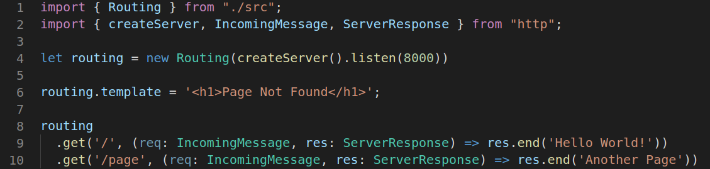

#Simple routing framework.

It knows how to answer on bad request 404 or 405 and have error page template, which you can change, from the box.

##API:
new Routing(http server, error page template optional)

routing.(method)(url, handler)

Example:

